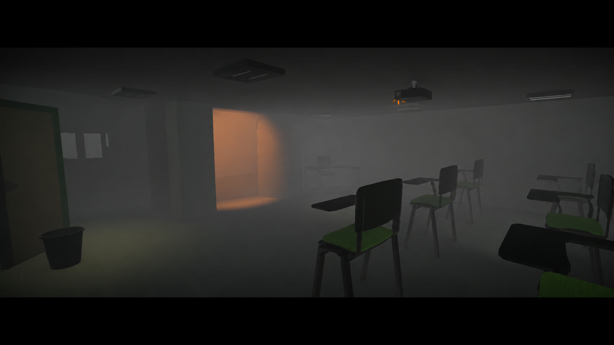
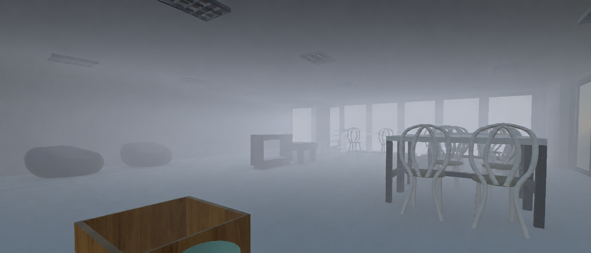
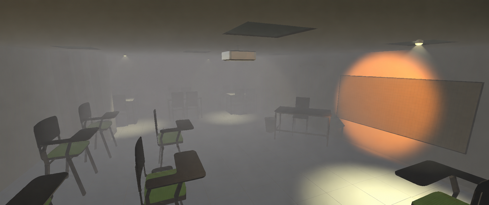

<!-- ====================================================== -->
<!--  PORTADA                                              -->
<!-- ====================================================== -->

# 🎮 FET

### *Survival horror de exploración ambientado en la universidad*

 

**Proyecto académico — Ingeniería de Software**
[Fundación Escuela Tecnológica de Neiva "Jesús Oviedo Pérez" · FET](https://www.fet.edu.co/Software)

 

### ▶️ [**DESCARGAR Y JUGAR**](https://github.com/Osdam/Game_Fet/releases/tag/v0.1.0-alpha) &nbsp;·&nbsp; 🎬 [**VER VIDEO**](https://drive.google.com/file/d/1JrfBaDKVZUXduC-PBAC4aEs5YksJFMyi/view?usp=drive_link)

---

## 📑 Contenido

- [Descripción](#-descripción)
- [Cómo jugar](#-cómo-jugar)
- [Capturas del juego](#-capturas-del-juego)
- [Historia / Concepto](#-historia--concepto)
- [Características](#-características-principales)
- [Gameplay](#-gameplay)
- [Controles](#-controles)
- [Tecnologías](#-tecnologías-utilizadas)
- [Estado del proyecto](#-estado-del-proyecto)
- [Equipo](#-equipo-de-desarrollo)

---

## 🕯️ Descripción

**FET** es un videojuego de terror y exploración desarrollado como proyecto académico de Ingeniería de Software en la **Fundación Escuela Tecnológica de Neiva "Jesús Oviedo Pérez" — FET**.

El juego está inspirado en la atmósfera del *survival horror* clásico: pasillos oscuros, niebla, iluminación limitada, tensión ambiental y una universidad transformada en un espacio inquietante. El escenario principal está basado en la FET, especialmente en el **Bloque 1**, reinterpretado dentro de una experiencia oscura, misteriosa y narrativa.

El jugador deberá recorrer las instalaciones, investigar pistas, resolver pequeños acertijos y avanzar por un ambiente donde la universidad parece estar abandonada, alterada y fuera de la realidad.

> 📌 *Proyecto académico sin fines comerciales.*

---

## 🎮 Cómo jugar

> **Si solo quieres probar el juego, esto es lo único que necesitas:**

1. Entra a la sección **[Releases](https://github.com/Osdam/Game_Fet/releases/tag/v0.1.0-alpha)** del repositorio.
2. Descarga la última versión disponible (`.zip`).
3. **Descomprime** el archivo completo (no ejecutes desde dentro del `.zip`).
4. Abre la carpeta y ejecuta el archivo del juego.
5. Si Windows muestra un aviso, elige *"Más información" → "Ejecutar de todas formas"* (es normal en juegos sin firma comercial).

### 📥 [Descargar desde Releases](https://github.com/Osdam/Game_Fet/releases/tag/v0.1.0-alpha)

> 🎧 *Recomendado jugar con audífonos y luz baja: el sonido es parte de la experiencia.*

---

## 📸 Capturas del juego

**Entrada / Ambiente principal**

  

**Salón 101 — Proyectores**

  

**Menú / Interfaz**

---

## 🎬 Video de presentación

Puedes ver una demostración del avance aquí:

> 🔗 **[Ver video del juego en Google Drive](https://drive.google.com/file/d/1JrfBaDKVZUXduC-PBAC4aEs5YksJFMyi/view?usp=drive_link)**

---

## 🌫️ Historia / Concepto

Después de una jornada normal en la universidad, el protagonista despierta dentro de una versión distorsionada de la FET. Los pasillos están vacíos y la niebla cubre los espacios abiertos.

Para salir, deberá recorrer el **Bloque 1**, encontrar pistas, activar mecanismos y descubrir qué ocurrió. La universidad deja de ser un lugar cotidiano y se convierte en un espacio de tensión, memoria y misterio.

---

## ✨ Características principales

- 🏫 Escenario inspirado en la **Fundación Escuela Tecnológica de Neiva — FET**.
- 🕯️ Ambientación de **terror psicológico** con niebla, luces bajas y sonido ambiental.
- 🎥 **Exploración en tercera persona**.
- 🧱 Recreación del **Bloque 1** como escenario jugable.
- 🧩 **Puzzles sencillos** integrados al recorrido.
- 🎨 Modelado y *assets* creados o adaptados en **Blender**.
- ⚙️ Desarrollo de gameplay, iluminación y lógica en **Unity**.

---

## 🎯 Gameplay

El objetivo principal es **explorar el escenario, encontrar objetos clave y resolver acertijos** para desbloquear nuevas zonas.

<table>
<tr>
<th>✅ Mecánicas actuales</th>
<th>🔜 Mecánicas planeadas</th>
</tr>
<tr>
<td valign="top">

- Movimiento del personaje
- Cámara de exploración
- Interacción con objetos
- Iluminación ambiental
- Niebla para atmósfera de terror
- Diseño inicial del Bloque 1
- Pruebas de jugabilidad y recorrido

</td>
<td valign="top">

- Inventario básico
- Más puzzles ambientales
- Eventos de sonido y sustos controlados
- Sistema de notas o documentos
- Enemigos o presencia paranormal
- Menú principal y pausa
- Mejoras en efectos visuales y postprocesado

</td>
</tr>
</table>

---

## 🕹️ Controles

| Acción | Tecla |
| :--- | :---: |
| Moverse | `W` `A` `S` `D` |
| Correr | `Shift` |
| Saltar | `Espacio` |
| Interactuar | `E` |
| Pausa | `Esc` |

---

## 🛠️ Tecnologías utilizadas

| Tecnología | Uso |
| :--- | :--- |
| **Unity 6.3** | Motor principal del videojuego |
| **Blender 5.1** | Modelado, edición y preparación de *assets* 3D |
| **C#** | Programación de mecánicas y lógica del juego |
| **Git / GitHub** | Control de versiones y publicación del proyecto |

---

## 📊 Estado del proyecto

El proyecto se encuentra actualmente en **fase de prototipo jugable**.

<table>
<tr>
<th>🟢 Avances actuales</th>
<th>🎯 Próximos objetivos</th>
</tr>
<tr>
<td valign="top">

- Plano inicial del Bloque 1
- Recorrido funcional
- Jugabilidad base implementada
- Primeras pruebas de ambiente de terror
- Integración inicial de iluminación y niebla
- Preparación de *assets* 3D

</td>
<td valign="top">

- Optimizar iluminación
- Mejorar diseño visual del escenario
- Añadir más interacciones
- Crear puzzles más claros
- Implementar menú principal
- Pulir experiencia jugable para presentación

</td>
</tr>
</table>

---

## 👥 Equipo de desarrollo

Proyecto desarrollado por estudiantes de **Ingeniería de Software** de la FET.

| Integrante |
| :--- |
| 👨‍💻 Oscar Daniel Mancipe Molina |
| 👨‍💻 Kevin Steven Guevara |
| 👨‍💻 Felipe Córdoba |
| 👩‍💻 Dany Catalina Ortega Zanabria |

---

## 🏛️ Institución

**Fundación Escuela Tecnológica de Neiva "Jesús Oviedo Pérez" — FET**
Programa: **Ingeniería de Software**
🌐 [www.fet.edu.co](https://www.fet.edu.co/)

---

## 📝 Nota para evaluación

Este repositorio contiene el avance del proyecto, incluyendo archivos del videojuego, capturas, descripción técnica y acceso a una versión jugable. El objetivo es presentar una experiencia interactiva de terror ambientada en la universidad, demostrando habilidades de diseño, programación, modelado 3D, integración de *assets* y desarrollo de gameplay en Unity.

---

## 📄 Licencia

Este proyecto fue desarrollado con **fines académicos**. El uso, modificación o distribución dependerá de las condiciones definidas por el equipo de desarrollo.

 

**#YoSoyFet**

